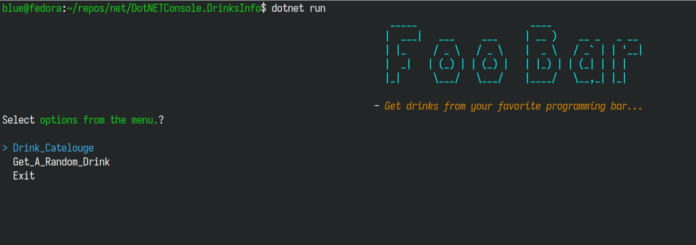

# FOO BAR
#### *- Get drinks from your favorite programming bar...*

---------------

### Tech
- .NET(v8.0).
- [Spectre.Console](https://spectreconsole.net)
- [Microsoft HTTP Requests](https://docs.microsoft.com/en-us/dotnet/csharp/tutorials/console-webapiclient)

### Features

- Keyboard Based Navigation.
  

- Easier selection based Menu & Strucuted Drink Summary.
  
  
  

- Get A Random Drink.
  

### Uses.
- #### Clone Repo.
  `git clone https://github.com/devjunaeid/DotNETConsole.Flashcards.git`
- #### Go to the project folder and restore.
    `dotnet restore`
- #### Build.
    `dotnet build`
- #### Run.
    `dotnet run`
